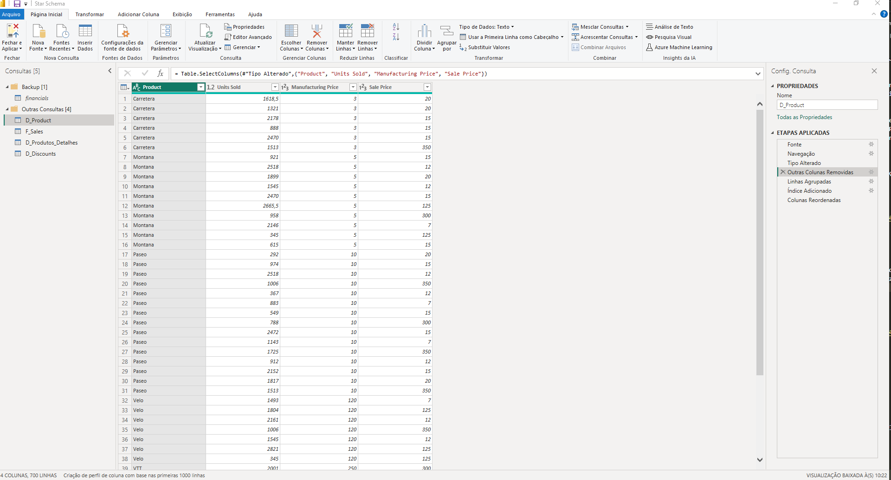
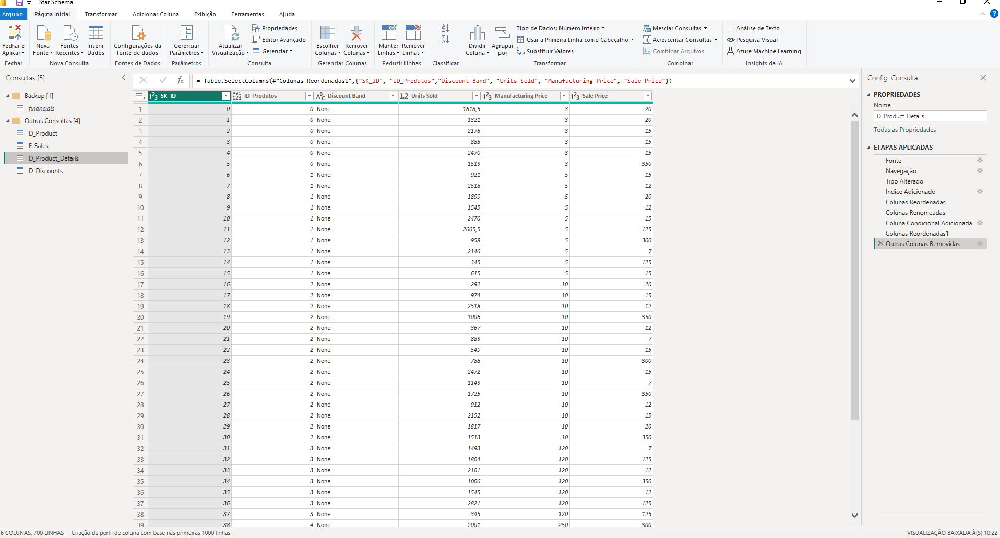
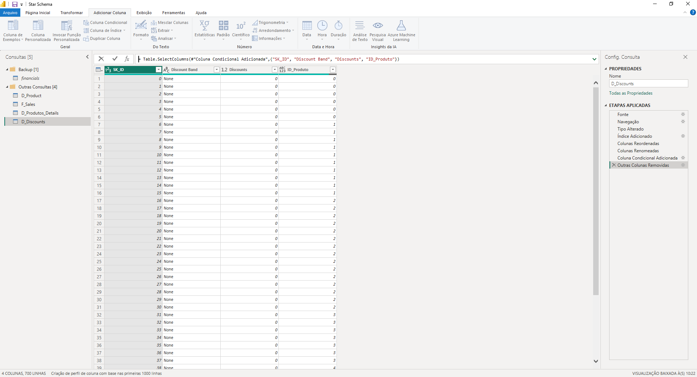
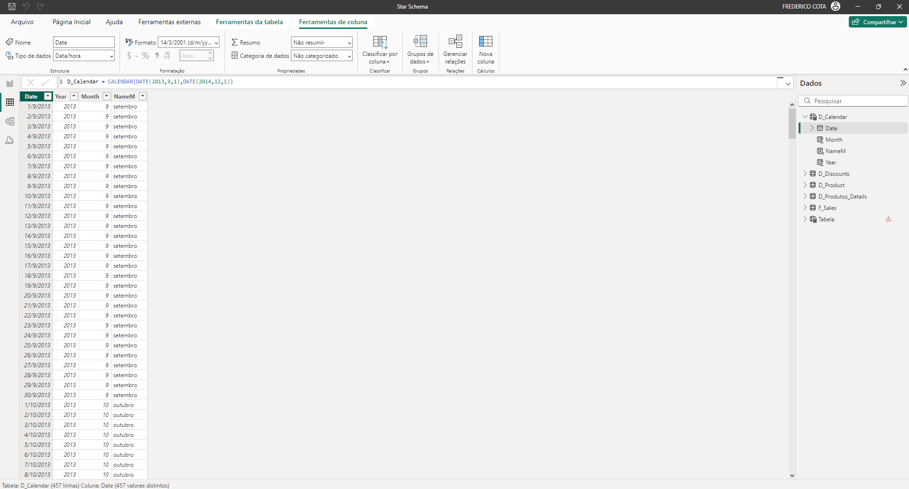

# Modelando um Dashboard de E-commerce com Power BI Utilizando Fórmulas DAX

## Descrição do projeto

Neste desafio de projeto, foi criando um modelo de dados baseado em Star Schema utilizando a tabela Financial Samples como base para a criação das tabelas fato e dimensão. A tabela Financial Sample apresentada as seguintes informações:
- Segmento de vendas.
- País das vendas.
- Produto vendido.
- Faixa de desconto.
- Unidades vendidas.
- Preço de fabricação.
- Preço de venda.
- Vendas brutas.
- Valor do desconto.
- Valor das vendas.
- Custo dos produtos vendidos.
- Lucro e data da vendas.

A tabela [Financial Sample]() utilizada no projeto pode ser baixada na pasta base de dados.

### Tabela Financial

## Modelo Star Schema 

 O modelo Star Schema, trata-se um modelo maduro e amplamente utilizado por Data Warehouses relacionais. Ele requer que os modeladores classifiquem suas tabelas de modelo como dimensão ou fato.

 **Tabelas dimensões**: Nessas tabelas são descritas as entidades de negocio, essas entidades podem incluir produtos, pessoas, locais e conceitos, incluindo o próprio tempo. A tabela mais consistente que existirá neste modelo é a tabela Data. Uma tabela Dimensão contém uma ou mais colunas de chaves que atuam como identificadores exclusivos e colunas descritivas.

 **Tabelas Fatos**: Nessas tabelas são armazenados os eventos ou observações que podem ser ordens de vendas, saldos de ações, taxas de câmbio, temperaturas, etc. Uma tabela fatocontém colunas chave de dimensão que são relacionadas as tabelas de dimensões e colunas de medidas númericas. As colunas de chave de dimensão, determinam a dimensionalidade de uma tabela de fatos, enquanto os valores de chave de dimensão determinam a granularidade da tabela fatos. As tabelas fatos diferentemente das tabela de dimensão, possuem um número relativamente grande de linhas que crescem ao longo do tempo.

A construção do modelo Star Schema baseou-se na tabela Financial Sample. Durante a criação do modelo, a tabela Financial Sample foi duplicada para dar origem a 3 tabelas dimensão e uma tabela fato. As tabelas de dimensão criadas foram D_Product, D_Product_Details, D-Discounts, já a tabela fato criada foi a F_Sales. Além das tabelas dimensão e fatos criadas a partir da Financial Sample foi criada a tabela dimensão dCalendar utilizando fórmulas DAX.

## Construção das tabelas

- **Construção da tabela D_Product:**

Para construir a tabela D_Product, foi realizada a duplicação da tabela Financial. 
- Em seguida, foi realizada da remoção de todas as colunas exceto "Product", "Units Sold", "Manufacturing Price", "Sale Price", este procedimento foi realizado utilizando o comando  remover outras colunas. 
- Na sequencia, foi utilizado o comando agrupar para criar as colunas Contagem, Média de unid. Vendidas, Valor médio das vendas, Valor máximo das vendas, Valor mínimo das vendas, Mediana do valor de vendas, Média de manufatura.

- ### Imagem da tela de criação das colunas agrupadas.

 

- Na sequencia foi criada a coluna índice, por meio da opção Coluna de Índice na guia Adicionar Coluna.
- Para finalizar, a coluna de índice foi movimentada da ultima posição da tabela para a primeira posição.

- ### Imagem da tabela D_Product

 

 ### **Construção da tabela D_Products_Details:**

Para construir a tabela D_Product_Details, foi realizada a duplicação da tabela Financial. 
- Em seguida foi realizada a inclusão da coluna índice, que será utilizada no relacionamento da tabela D_Products_Detalhes com a tabela F_Sales. Após a criação a coluna índice, a mesma foi remanejada da última posição da tabela para a primeira. Essa ação criou a etapa colunas reordenadas.
- Em seguida a coluna índice foi renomeada para o SK_ID.
- O próximo passo seguido, foi a criação de uma coluna condicional, na qual foi atribuido a cada produto um identificador único para a criação de relacionamento entre tabela e a redução do volume de dados armazenados na tabela. Esta coluna foi denominada ID_Produtos e após a criação, a mesma foi redordenada. 

- ### Imagem da tela de criação das colunas agrupadas.

 

- O ultimo passo executado na criação da tabela, foi a exclusão das colunas Segment, Country, Product, Gross Sales, Discounts, Sales, COGS, Profit, Date, Month Number, Month Name, Year, que não são necessarias a esta dimenssão.

- ### Imagem da tabela D_Product_Details

 

**Construção da tabela Discounts:**

Para construir a tabela D_Discounts, foi realizada a duplicação da tabela Financial. 
- Em seguida foi realizada a inclusão da coluna índice, que será utilizada no relacionamento da tabela D_Discounts com a tabela F_Sales. Após a criação a coluna , a mesma foi remanejada da última posição da tabela para a primeira. Essa ação criou a etapa colunas reordenadas.
- Em seguida a coluna índice foi renomeada para o SK_ID. 
- O próximo passo seguido, foi a criação de uma coluna condicional, na qual foi atribuido a cada produto um identificador. Essa ação permite a criação de relacionamento entre tabelas e a redução do volume de dados armazenado na tabela. Esta coluna foi denominada ID_Produtos e após a criação a mesma foi redordenada.

- ### Imagem da tabela D_Discount

 

### **Construção da tabela D_Calendar:**

- Para a construção da tabela D_Calendar foi utilizado a Fórmula DAX CALENDAR.
- Após a construção da primeira coluna Date da tabela D_Calendar, foi utilizado outras as fórmulas DAX para a construção das demais colunas da tabela.

|Coluna|Fórmula DAX|Descrição|
|------|-----------|---------|
|DATE| D_CALENDAR = CALENDAR(DATE(2013,9,1),DATE(2014,12,1))| A fórmula CALENDAR cria uma tabela a partir de uma data inicial DATE(2013,9,1) e uma data final DATE(2014,12,1). Romenda-se que seja utilizado um intevalo de data que contemple o período da tabela Fato.|
|Year| Year = D_Calendar[Date].[Ano]|Esta fórmula retorna o ano de cada data existente na coluna Date|
|Month| Month = D_Calendar[Date].[MonthNo]|Esta fórmula retorna o numero do mês de cada data existente na coluna Date|
|NameM| NameM = D_Calendar[Date].[Mês]|Esta fórmula retorna o nome do mês por extenso de cada data existente na coluna Date|

- ### Imagem da tabela D_Calendar

 

## Criação do modelo

Após a criação das tabelas Fato e Dimensão no editor do Power Qwery, as novas tabela foram carregadas para o Power BI para criação dos relacionamentos entre as tabelas que irá permitir a realização das análises dos dados.

A tabela D_Product_Details foi relacionada com a tabela F-Sales por meio do campo SK_ID, criando um relacionamento de cardinalidade 1 para 1, onde cada elemento da tabela F_Sales possui um elemento relacionado na tabela D_Product_Details.

A tabela D_Discount foi relacionada com a tabela F-Sales por meio do campo SK_ID, criando um relacionamento de cardinalidade 1 para 1, onde cada elemento da tabela F_Sales possui um elemento relacionado na tabela D_Discount.

A tabela D_Product foi relacionada com a tabela F-Sales por meio do campo Product, criando um relacionamento de cardinalidade 1 para *, onde cada elemento da tabela D_Product possui muitos elemento relacionados na tabela F_Sales.

- ## Modelo Star Schema desenvolvido.

 

## Autor

[Lucirene J. Silva](https://github.com/lucirenejose1993)