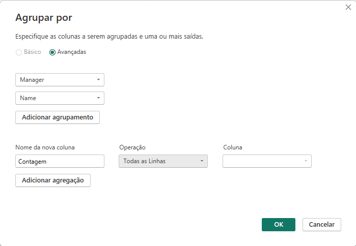

# Local de acesso ao projeto

https://app.powerbi.com/groups/me/reports/155e366c-2c8f-4030-a7c0-c76142d38da6/ReportSection?experience=power-bi

O desafio consiste em criar um BD, fazer a coleta desse BD utilizando o power BI e logo após transformar os dados afim de deixá-los aptos para a criação de relatório.

Foi sugerido a criação de uma instância no azure para a criação e inserção de dados no banco, porém como não tenho mais créditos para utilização no azure criei e inseri dados no banco localmente utilizando para isso o script .

### Após a criação do banco os dados foram integrados com o Power BI e os passos a seguir foram efetuados:

1. Os cabeçalhos e tipos de dados foram verificados, já que por vezes o power BI não sugere o melhor tipo de dados para o dado que temos.

2. Os valores monetários foram modificados para o tipo double preciso.

3. A existência de nulos foi verificada e como não havia valores nulos relevantes somente as colunas criadas pelo power BI foram removidas.

4. Colunas complexas do banco foram divididas. A coluna complexa address localizada na tabela employee foi dividida, a divisão foi realizada usando como delimitador o caractere "-", após a divisão as colunas foram renomeadas para number, street, city e state. As colunas street e number foram reogarnizadas e alguns valores foram substituídos (street fire-Oak) para remoção de uma coluna a mais criada pelo power BI após a divisão.

## Coluna antes da divisão

## Colunas após a divisão

5. Foi realizada a mescla de consultas entre as tabelas employee e departament para criação de uma nova tabela employee com o nome dos departamentos associados aos colaboradores. A mescla teve como base a tabela employee utilizando-se os campos Dno e Dnumber como referência. Após a criação da mescla as colunas Dnumber e todas a outras de departament foram excluídas exceto Dname que foi renomeada para Departament.

## Parâmetros da Mescla de Consultas

## Resultado da Mescla de Consultas

6. Foi realizada a junção dos colaboradores e respectivos nomes dos gerentes. A junção foi realizada no Power BI e Utilizou-se a tabela employee para criação da mescla de tabelas. A mesma tabela foi utilizada para obter a junção fazendo a ligação de Super_Ssn com Ssn.

## Parâmetros da Mescla de Consultas

## Resultado da Mescla de Consultas

7. As colunas de Nome e Sobrenome foram mescladas para ter apenas uma coluna definindo o nome dos colaboradores. Foi utilizada a opção de mesclar colunas com o sperador espaço selecionado, após a mescla a coluna foi renomeada para Name.

## Parâmetros da Mescla de Colunas

## Resultado da Mescla de Colunas

8. Foi criada uma nova mescla de consultas entre as tabelas departament e dept_locations utilizando as colunas Dnumber como parâmetro, a tabela gerada gerada foi renomeada para dept_namelocation, as colunas desnecessárias e duplicadas foram removidas e a mescla de colunas entre as colunas Dname e Dlocation foi realizada.

## Parâmetros da Mescla de Consultas

## Resultado da Mescla de Consultas

9. No passo anterior foi utilizada a opção mesclar consultas e não a opção acrescentar visto que a há uma coluna em comum que combina as duas consultas.

10. Foi realizado o agrupamento das colunas Manager e employee a fim de saber quantos colaboradores existem por gerente.

## Parâmetros do Agrupamento de Colunas

## Resultado do Agrupamento de Colunas

